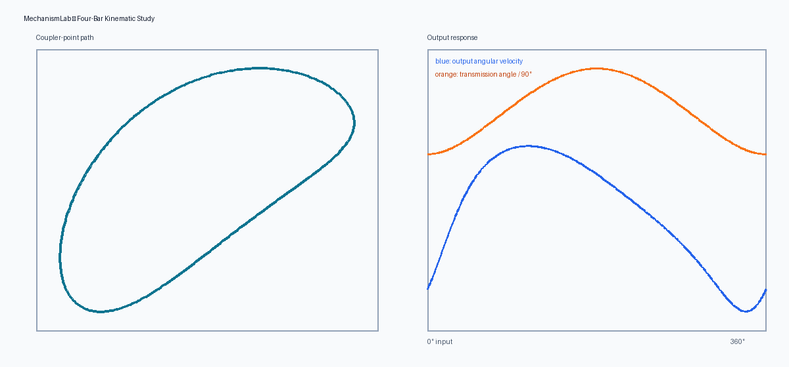

# MechanismLab

A validated Python tool for planar four-bar linkage analysis. It solves position, angular velocity, angular acceleration, transmission angle, and coupler-point paths, then exports a plot, CSV dataset, and engineering summary.



## Why this project

Four-bar mechanisms appear in clamps, pumps, suspension systems, folding products, and automated machinery. MechanismLab turns the vector loop-closure equations into a reusable analysis package suitable for early design studies.

## Features

- Open and crossed assembly modes
- Circle-intersection position solution
- Velocity and acceleration from differentiated constraint equations
- Grashof condition and Grübler mobility
- Toggle/singularity detection
- Arbitrary coupler-point paths
- CSV, PNG, and Markdown report generation
- Unit tests against geometric closure and finite differences

## Install and run

```bash
python3 -m venv .venv
source .venv/bin/activate
pip install -e .
python -m mechanism_lab --ground 100 --crank 35 --coupler 110 --rocker 80 --output results/example
python -m unittest discover -s tests -v
```

Lengths can use millimetres, inches, or another consistent unit. Angular velocity and acceleration use radians per unit time and radians per unit time squared.

## Model

With fixed pivots **O₂** and **O₄**, input crank **r₂**, coupler **r₃**, and rocker **r₄**, position is constrained by:

```text
r₂ + r₃ - r₄ - r₁ = 0
```

MechanismLab locates the moving joint as the intersection of circles centered at the crank endpoint and output pivot. Differentiating the loop equation produces a 2 × 2 linear system for coupler and output angular velocity; differentiating again produces angular acceleration.

The solver raises explicit exceptions for unreachable positions and singular toggle configurations rather than returning plausible-looking invalid values.

## Validation

The test suite confirms:

- All four link lengths close to numerical precision.
- Analytical joint velocity agrees with a finite-difference estimate.
- Coupler-point endpoints coincide with their joints.
- Invalid geometry and invalid link lengths fail clearly.

See the generated [example report](results/example/REPORT.md) and [CSV results](results/example/kinematics.csv).

## Engineering limitations

This is a rigid-body, planar, zero-clearance kinematic model. It does not predict stress, deflection, friction, bearing load, backlash, collision, fatigue, or manufacturing variation. Those effects must be evaluated before releasing a physical mechanism.

## Skills demonstrated

mechanism design · kinematics · numerical methods · Python · validation · engineering visualization · technical documentation
